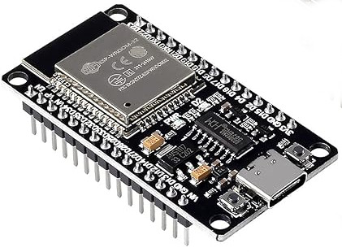

# Bluetooth macro remote

The project builds a remote control that can send media key inputs and run macros on computer. This is similar to macro keyboard / macroboard. Instead of keyboard we are going to use a remote control.

The media keys work on any device that accepts bluetooth HIDs. **

- Computer (with bluetooth on motherboard or dongle)
- Smart phones
- Tablets
- Smart televisions (TV)

\** For some devices or apps media keys need to be enabled in settings.

This is how the final device looks:


## 1. Required components

You can buy these from any local electronic components' shop or website:

1. [ESP32 development board](https://www.amazon.com/DORHEA-Development-Bluetooth-ESP-WROOM-32-ESP32-DevKitC-32/dp/B0B18JQF16) - $6
  \
Try to get the one with type-c port.

    If know how to solder things then you can also get thumb sized mini [ESP32C3 or ESP32S3](https://www.amazon.com/ESP32S3-2-4GHz-Wi-Fi-Dual-core-Supported-Efficiency-Interface/dp/B0BYSB66S5) module.

2. For programming ESP32, [USB to Type-c data cable](https://www.amazon.com/10Gbps-Android-Compatible-External-Samsung/dp/B0CLMY3B8G). Or if ESP32 has micro USB port then [USB to micro usb data cable](https://www.amazon.com/Amazon-Basics-Charging-Transfer-Gold-Plated/dp/B0711PVX6Z). Make sure the cable is not longer than 30cm. If the cable is longer then it needs to be of high wattage 10-15Watts.\
  No need to buy a new data cable if you are already using such cable for smartphone or other devices.

3. [IR wireless remote control with receiver](https://www.amazon.com/DIANN-HX1838-Infrared-Wireless-Control/dp/B0BWY74RYW) - $1.5
  

### Optional components

1. [Bluetooth dongle](https://www.amazon.com/Avantree-Bluetooth-Computer-Wireless-Headphones/dp/B08GM1MV6B). If your PC doesn't have bluetooth on motherboard.
2. [USB to type-c power cable with button](https://www.amazon.com/VEGET-Raspberry-Switch-Arduino-Devices%EF%BC%883-Pack%EF%BC%89/dp/B07VSC1X2Y). This is to power the device afterwords using PC or smartphone charger. Make sure to buy higher wattage charging cable e.g. 10-15 watt.
3. If you wish to make things concise and more permanent then you'll have to solder the components. Then you'll need [25 watt soldering kit](https://www.amazon.com/Soldering-Interchangeable-Adjustable-Temperature-Enthusiast/dp/B087767KNW).

## 2. Programming ESP32

Note: If you have Windows computer then try to use it because many things work out of the box there. This is just for compiling and uploading code to ESP32. Later on the ESP32 could be used with any devices and PC with any operating system as a keyboard.

To program ESP32 we are going to use [PlatformIO](https://platformio.org/) IDE software. Refer following guides to setup the PlatformIO extension in VSCode IDE:

- Windows: [Setup VS-code + PlatformIO to build ESP-Easy in Windows](https://www.youtube.com/watch?v=ArqwMcYSMsU) video
- macOS: [How To Install PlatformIO (ESP32 + Arduino series)](https://www.youtube.com/watch?v=5edPOlQQKmo) video


To get hang of the ESP32 programming follow the first 14 minutes of [YOU can Learn the ESP32 in 15 Minutes: Hello World!](https://www.youtube.com/watch?v=XLQa1sX9KIk) video. You could also get more info about your device using the code in [log_device_info.txt](./bt-esp32-keyboard/src/log_device_info.txt) file.

**Note:**

- If the ESP32 is not detected by the computer then refer [Install Serial Drivers for ESP32](https://www.youtube.com/watch?v=JmDxP4O4Trk) video to install the USB drivers.
- You may have to press and release boot button when `Connecting....` message appears in the logs while uploading the code.

Perform following steps to get started:

1. Close VSCode IDE.
2. Download and extract this repo to a suitable location.
3. Connect the ESP32 device to your computer.
4. Identify the USB/COM port the USB got connected to.
   - Windows: Open ["Device Manager"](./assets/device-manager.png) and expand `Ports (COM & LPT)` section to see the port. It would be something like `COM3` and `COM5` etc.
   - macOS: Run `ls /dev/tty*` in a terminal before and after plugging the ESP32.
   - linux: Run `ls /dev/ttyUSB*` in terminal before and after plugging the ESP32. To get access to the USB port refer [this StackOverflow thread](https://askubuntu.com/questions/112568/how-do-i-allow-a-non-default-user-to-use-serial-device-ttyusb0).
5. In file `bt-esp32-keyboard/platformio.ini` update `monitor_port` value and if you face any issues then update `board` value.
6. Mostly `esp32dev` as the board name should work. If it doesn't work then get the name from the product page on seller's website.
7. Open VSCode IDE then click on PlatformIO logo on left bar. Select pick a folder and open the `bt-esp32-keyboard` folder in the IDE. The IDE will install required libraries.

### Get key codes on remote control

Backup the code in `main.cpp`. Then put code in [log_remote_keys.txt](./bt-esp32-keyboard/src/log_remote_keys.txt) in `main.cpp` file and upload the compiled code to the ESP32. Monitor serial logs in the IDE and press all the keys on the remote one by one. Note down all the key codes.

Restore code in `main.cpp`.

### Key codes functions

In `main.cpp` update remote control key codes if they are different. You can also update media keys in `bleKeyboard.write(...)` statements. Following keys are available:

- KEY_MEDIA_NEXT_TRACK
- KEY_MEDIA_PREVIOUS_TRACK
- KEY_MEDIA_STOP
- KEY_MEDIA_PLAY_PAUSE
- KEY_MEDIA_MUTE
- KEY_MEDIA_VOLUME_UP
- KEY_MEDIA_VOLUME_DOWN
- KEY_MEDIA_WWW_HOME
- KEY_MEDIA_LOCAL_MACHINE_BROWSER
- KEY_MEDIA_CALCULATOR
- KEY_MEDIA_WWW_BOOKMARKS
- KEY_MEDIA_WWW_SEARCH
- KEY_MEDIA_WWW_STOP
- KEY_MEDIA_WWW_BACK
- KEY_MEDIA_CONSUMER_CONTROL_CONFIGURATION
- KEY_MEDIA_EMAIL_READER

In the code, remaining numbered keys on the remote have been assigned to keyboard key combinations from `ctrl + shift + F1` to `ctrl + shift + F11`. These key combinations are to be assigned to macros on computer.

Compile and upload the `main.cpp` to ESP32. Now we have programmed the ESP32. Disconnect ESP 32 from the computer.

## 3. Assembling the RF receiver

The remote control is the RF signal sender and ESP32 with the tree pin module is the receiver part. Now let's assemble the receiver part.

For the ESP32 dev board mentioned above following is the pinout diagram:


If you have bought different ESP32 module then get the pinout from the seller or from internet.

We want to connect the RF receiver to ESP32 as shown in following diagram:


Use the three [female-to-female jumper cables](https://www.amazon.com/Antrader-Breadboard-Dupont-Arduino-Raspberry/dp/B07S2RH6Q4) to connect the RF receiver to ESP32. The jumper cables come along with the IR remote module so no need to buy them separately.

ESP32 to RF receiver connections are as follows:

1. GND pin to `-` pin
2. D15 (GPIO15) pin to `S` pin
3. 3.3v pin to the remaining (middle) pin `+`

The LED that came with the remote module is not required because we are using the builtin LED on the ESP32 board which is accessed using pin 2.

## 4. Connect to PC

Now power the ESP32 using the type-c power cable with button. You can power it directly using USB charger as well. If your PC has bluetooth on motherboard then enable it. Otherwise use a bluetooth dongle and enable it. Bring up the bluetooth manager and look for a device named "Macro Remote". And connect to the device.

Play any media on the PC and try the arrow buttons on the remote control.

## 5. Assigning 'ctrl + shift + Fx' key combinations to macros

### Windows

Install [AutoHotkey](https://www.autohotkey.com/) free software. Edit `macros/win-autohotkey-macros.ahk` file and update/add keyboard shortcuts and commands.

Refer the [How to Launch AutoHotkey Scripts At Startup (4k)](https://www.youtube.com/watch?v=qo3XIAbHbCo) video to load the `.ahk` file on the computer startup.

### Linux

Install [Xbindkeys](https://wiki.archlinux.org/title/Xbindkeys). Edit `macros/.xbindkeysrc` file and put the macro code in `~/.xbindkeysrc`. Run following commands to update the configuration:

```bash
killall xbindkeys
xbindkeys -f ~/.xbindkeysrc
```

### macOS

Use [Quicksilver](https://qsapp.com/) to setup the macro script. Refer [Performing common tasks quickly on macOS using Quicksilver scripts
](https://www.youtube.com/watch?v=5mXnfjCN0M8) video to create the script to map the key combinations.

Following are some macOS commands that could be used for macros:

- Turn off display `pmset displaysleepnow`
- Shutdown `sudo shutdown -h now`
- Restart `sudo shutdown -r now`
- Mute `sudo osascript -e "set Volume 0"`
- 40% volume `sudo osascript -e "set Volume 4"`
- 80% volume: `sudo osascript -e "set Volume 8"`

\
Now test all the numbered buttons on the remote. Except the shutdown button :D.

## 6. Finishing touch

### Enclosure

Put the ESP32 receiver in any small enclosure. If the enclosure is not transparent then make sure the IR receiver remains outside because it needs to be in line of sight with the remote.

### Remote key stickers

Print [icons.png](./assets/icons.png) image on A4 size paper. Cut the icons and stick them on remote control keys. Use [rubber based glue](https://www.amazon.com/Fevibond-Synthetic-Rubber-Adhesive-Leather/dp/B075MCSRLY/) to keep key membranes flexible.
